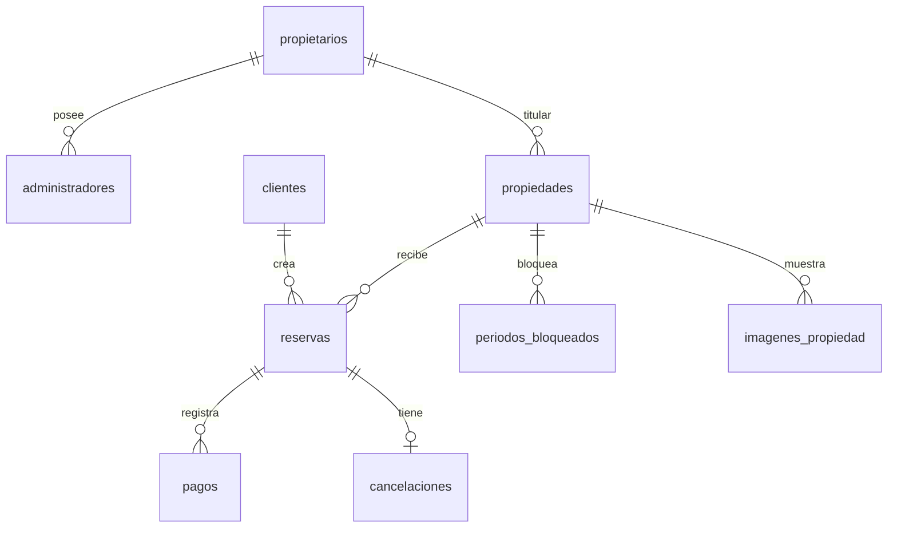

# Base de datos

Las entidades TypeORM están en `backend/src/persistence/entities.ts`; la migración ejecutable es `backend/src/persistence/migrations/1780000000000-Initial.ts`.

`auth.users` pertenece a Supabase Auth. `clientes.auth_user_id` y `administradores.auth_user_id` son UUID únicos y FK hacia esa tabla: enlazan identidad/autenticación externa con datos de dominio, sin duplicar contraseñas.

`Propietario` es titular; `Administrador` referencia al propietario y tiene rol `titular|empleado`; `Cliente` aporta documento, contacto y nacimiento. `Propiedad` guarda capacidad, horarios, ubicación, precio, seña, límite y estado. `Reserva` guarda fechas, estado y montos históricos. `PeriodoBloqueado` reserva inventario sin cliente. `Pago` tiene transacción externa única. `Cancelacion` exige exactamente un actor y es única por reserva. Outbox/receipt hacen confiable el correo.

Restricciones importantes: checks de rangos/estados, únicos de documentos/emails y `reservas_no_superpuestas`, una exclusion GiST con `daterange(fecha_desde,fecha_hasta,'[)')`. `[)` incluye ingreso y excluye egreso: dos estadías pueden tocarse el mismo día. Índices aceleran propiedad, cliente, estado y fechas. `numeric(14,2)` evita errores de dinero binario.

`seed.ts` y `seed-coverage.ts` son idempotentes; `optional-seed.ts` los ejecuta. La transacción y `pg_advisory_xact_lock` en disponibilidad complementan la constraint para concurrencia.
