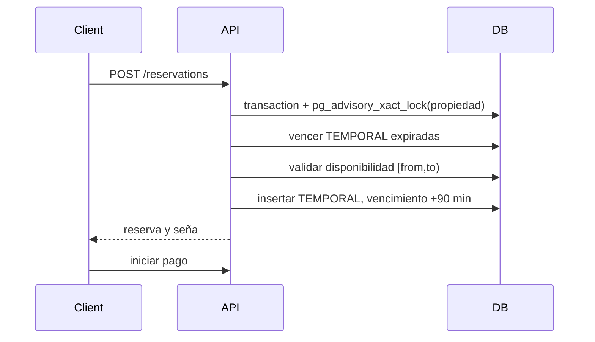

# Flujo de reserva

El detalle (`frontend/src/app/catalog.ts`) monta `AvailabilityCalendarComponent`. Este consulta `GET /properties/:id/availability`; `AvailabilityService.check` devuelve confirmadas, temporales vigentes y bloqueos. Canceladas y vencidas no bloquean.

Las fechas usan `[ingreso, egreso)`: noches = diferencia de días; egresar el día de inicio de otra estadía es válido. `calendar-domain.ts` impide rango pasado, fuera del límite o que interseque un período ocupado.

`ReservationsService.create` toma lock con `lockProperty`, verifica propiedad activa, usa `validateStay`, `expireProperty`, `assertAvailable` y `quote` (`backend/src/common/domain.ts`). Guarda total/seña con `Decimal` y estado `TEMPORAL`; `JobVencimientoReservas` vuelve vencidas las no pagadas cada 30 s. La constraint GiST impide solapamientos aun si otro código intenta insertar sin service. Cancelaciones están en `cancellations.service.ts`: cliente dentro de 72 h; administrador puede excepción con motivo.

Sin transacción/lock dos requests podrían leer disponibilidad simultáneamente. Sin exclusion constraint un bug futuro podría reintroducir ese error.
