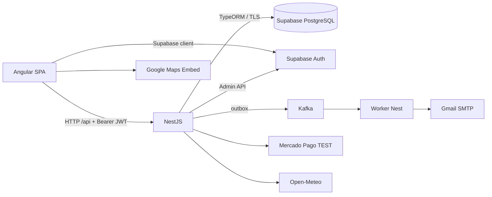

# RENTIFY: visión del sistema

Rentify gestiona alquileres temporarios: un cliente busca una propiedad, elige un rango disponible, crea una reserva temporal, paga la seña y la reserva queda confirmada. El sistema también permite a administradores gestionar propiedades, bloqueos, reservas, pagos, cancelaciones y reportes.

## Actores y capacidades

- **Cliente:** se registra, verifica correo, inicia sesión, consulta propiedades, reserva, paga y cancela sus propias reservas.
- **Administrador:** pertenece a un propietario; administra el inventario de ese propietario y consulta operaciones/reportes.
- **Propietario:** titular de las propiedades; en el modelo actual no inicia sesión directamente.

## Arquitectura

El frontend está en `frontend/src/app/`; Angular renderiza páginas y llama a `Api` (`frontend/src/app/core.ts`). El backend Nest está en `backend/src/`; controllers reciben HTTP, services aplican reglas y TypeORM llega a PostgreSQL. La base principal es Supabase PostgreSQL, mientras Supabase Auth conserva identidades y contraseñas. Kafka transporta eventos: no envía correos por sí mismo; `backend/src/worker.ts` los consume y usa Nodemailer/Gmail.

## Decisiones que conviene defender

Separar Auth de los perfiles Rentify evita guardar hashes de contraseña en tablas propias. Una reserva temporal durante 90 minutos reserva inventario mientras se paga. La transacción, el lock por propiedad y la exclusion constraint de PostgreSQL protegen contra doble reserva. El webhook de Mercado Pago, y no el regreso del navegador, confirma el pago porque es la señal servidor-a-servidor verificable.

Leé después [REPOSITORY-GUIDE.md](REPOSITORY-GUIDE.md) y [AUTH-FLOW.md](AUTH-FLOW.md).
